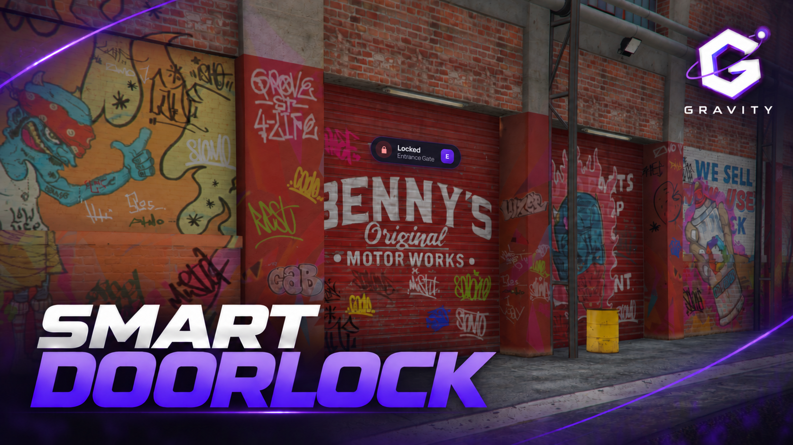
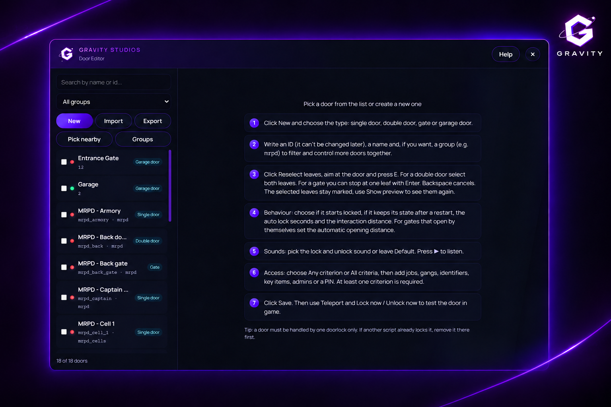
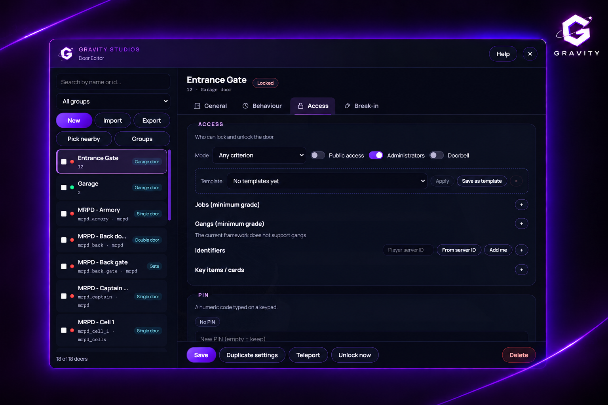
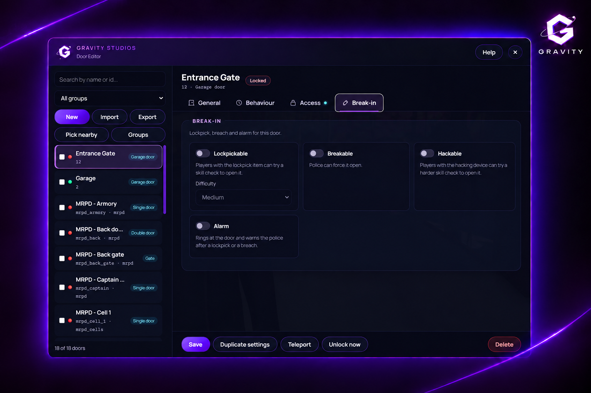
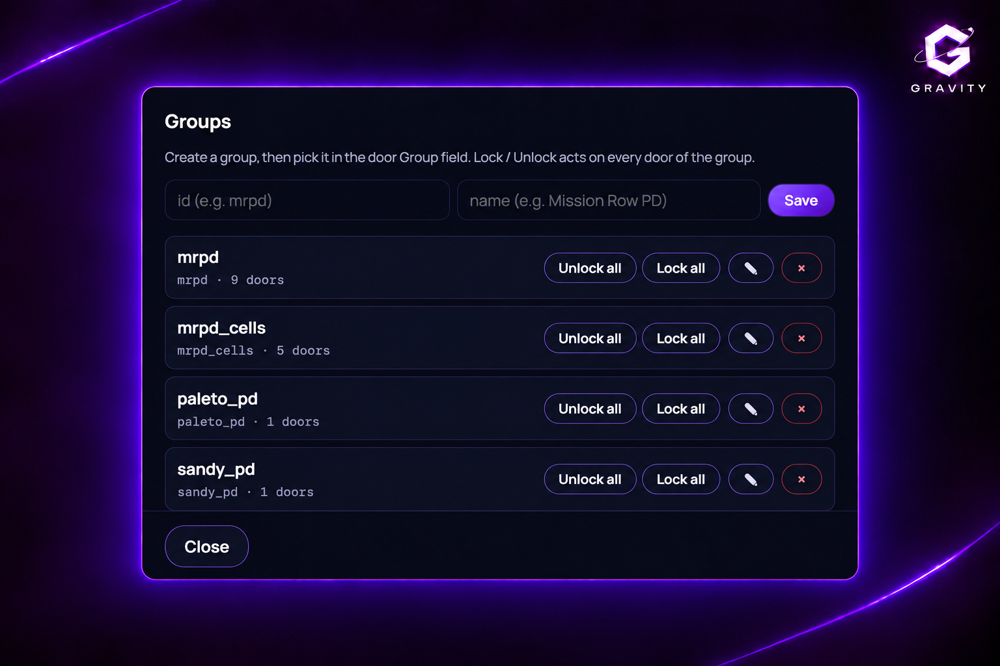
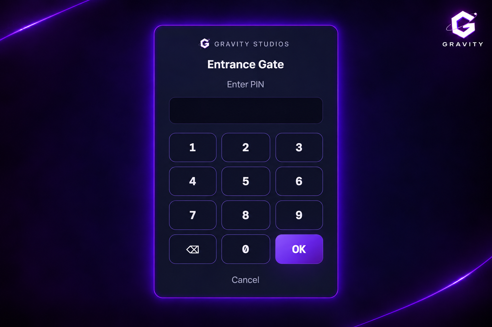

# g_doorlock



A free FiveM doorlock resource by Gravity Studios. Supports single and double doors, gates and garage doors, with an in-game editor, server-side access checks and synchronized lock states.

## Features

- In-game editor (`/dooradmin`): create, edit, group, import and export doors
- Access by job, gang, identifier, item (with metadata) or PIN
- Lockpicking, hacking and breaching with configurable minigames, alarms and door repair
- Doorbell, garage remote, opening hours, automatic gates
- Import from ox_doorlock and qb-doorlock; included door packs
- Configurable notifications and text UI
- ESX, QBCore, QBX or standalone · ox_inventory, qs-inventory, qb-inventory or ESX inventory
- 6 languages: en, it, de, fr, es, pt

## Showcase











## Requirements

- OneSync
- [ox_lib](https://github.com/overextended/ox_lib)
- [oxmysql](https://github.com/overextended/oxmysql)
- Optional: ox_target. Keyboard controls: `E` to interact, `G` for break-in actions.

## Installation

1. Put `g_doorlock` in your resources (keep the folder name).
2. Import `sql/install.sql` (tables are also created on start).
3. Add to `server.cfg` after your framework and inventory:

```cfg
ensure g_doorlock

add_ace group.admin g_doorlock.admin allow    # editor
add_ace group.admin g_doorlock.bypass allow   # "Administrators" criterion on doors
set g_doorlock_webhook "https://discord.com/api/webhooks/..."   # optional
```

4. Add the items you use to your inventory (see below).

## Configuration

Use `config.lua` for shared settings and `config_server.lua` for admin groups, Discord logs and the update check.

```lua
Config.Notify = { system = 'ox_lib' }     -- ox_lib | esx | qb | qbx | okokNotify | mythic_notify | brutal_notify | wasabi_notify | custom
Config.TextUI = { system = 'g_doorlock' } -- g_doorlock | ox_lib | esx | qb | okokTextUI | cd_drawtextui | jg-textui | custom | false
```

Minigames run on the client and return `true` on success. To use a different minigame, replace the callback:

```lua
Config.Lockpick.minigame = function(checks, difficulty)
    return lib.skillCheck(checks)
end
```

## Items

| Item | Used for |
|---|---|
| `lockpick` | Lockpicking |
| `hacking_device` | Hacking |
| `garage_remote` | Garage remote control |

Any inventory item can be configured as a key in the editor. For ox_inventory, add the client export to the garage remote item:

```lua
['garage_remote'] = { label = 'Garage Remote', weight = 50, client = { export = 'g_doorlock.useRemote' } },
```

To restrict a key to a door or group, set its `doorkey` metadata:

```lua
exports.ox_inventory:AddItem(source, 'keycard', 1, { doorkey = 'mrpd_armory' })
```

## Exports

```lua
local dl = exports.g_doorlock

dl:lockDoor('mrpd_front')
dl:unlockDoor('vault', 60)            -- relock after 60 s
dl:setGroupState('mrpd', true)
dl:isLocked('mrpd_front')
dl:canAccess(source, 'mrpd_armory')
dl:setTempAccess('house_12', { identifiers = { 'ABC123' } }, 3600)
dl:addTempPin('motel_12', '4821', 86400)
```

Server event: `g_doorlock:stateChanged (id, locked, src, reason)`. More hooks in `hooks.lua`.

## Notes

- Use only one doorlock resource per physical door to avoid conflicting states.
- MLO doors must support GTA door physics.
- If an imported door doesn't lock, open it in the editor and use **Reselect leaves**.

## License

[GPL-3.0](LICENSE)
